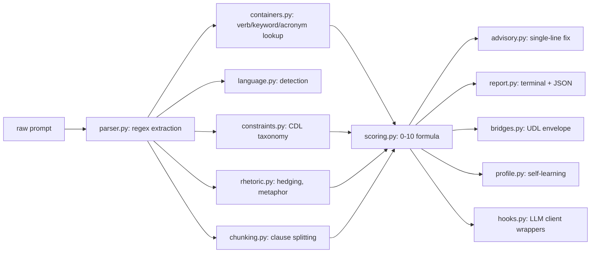

# Ambiguity Analyzer Architecture

| Field | Value |
|-------|-------|
| Status | Approved |
| Created | 2026-05-30 |
| Modules | [Core](plans/modules/01-core.aps.md) |

## Problem

Human-written prompts contain ambiguity that LLMs silently resolve in unpredictable ways. No tool deterministically measures pre-flight translation risk without calling an LLM.

## Design

**Deterministic pipeline** — regex extraction → dict lookup → arithmetic scoring. No LLM calls, no ML, no network.

### Data Flow

### Dual Implementation

Python (`src/ambiguity/`) and TypeScript (`ts/src/`) share:
- Identical verb taxonomy (110 verbs)
- Identical acronym registry (20 acronyms)
- Identical rhetoric tables (38 hedges, 22 emphatics)
- Identical scoring formula (verb_specificity × container_overlap + constraint_count × instruction_density + entropy_indicators)
- Identical constraint taxonomy (7 types × 3 categories)

### Integration Points

| Point | Mechanism |
|-------|-----------|
| CLI | `ambiguity analyze` (Python), `ambiguity` (TS npm binary) |
| SDK | `Analysis` class, `parse()`, `Profile` |
| LLM hooks | `AnthropicHook`, `OpenaiHook` (Python wraps SDK, TS returns result) |
| Federation | `bridges.py` try/import from C:\Federation |
| Pre-commit | `.githooks/pre-commit` — blocks `.md` commits scoring > 6.0 |
| CI | `.github/workflows/ambiguity-gate.yml` — PR gate |

## Constraints

- **Deterministic only.** No module may call an LLM. All analysis is regex + dict lookup + arithmetic.
- **No external runtime dependencies.** Federation bridge is try/import with silent failure.
- **Dual sync.** Both implementations must stay identical.

## Decisions

- D-001: Zero external runtime deps — ensures pip and npm installs are clean
- D-002: Dual Python/TS — Python for Federation integration, TS for npm/Browser ecosystem
- D-003: Embedding analysis opt-in (`AMBIGUITY_EMBEDDINGS=1`) — keeps core deterministic
- D-004: Pre-commit exempts agent instruction files — prevents false-positive blocks on CLAUDE.md, AGENTS.md, etc.
