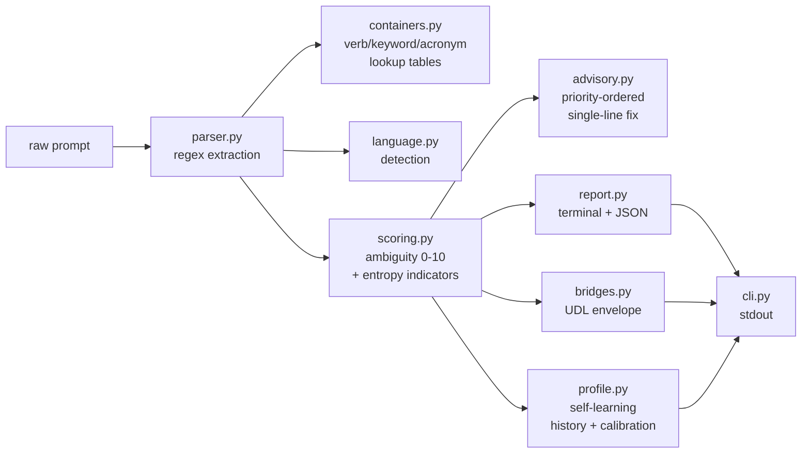

# ambiguity — Agent Guide

## Onboarding (read this first)

- **opencode.json** is the canonical agent entry point — opencode uses it
- **CLAUDE.md** is read by Claude Code on project entry
- **docs/QUICKSTART.md** has install, usage, and learning commands
- **docs/memory.md** tracks session history and open decisions
- **docs/AGENTS.md** (this file) — full conventions and handoff

This project has a **dual implementation**: Python (`src/ambiguity/`) for
Federation integration, TypeScript (`ts/src/`) as the canonical npm package.
**Keep both in sync** — same modules, same logic, same verb taxonomy.

## What this is

Deterministic prompt analysis for human-to-model translation. Pre-flight
linter that scores ambiguity, maps verbs to prediction-space containers,
expands acronyms, flags missing constraints, and outputs UDL envelopes.

Zero LLM calls. Zero token cost.

## Build / test

```bash
pip install -e .
pytest tests/
ambiguity analyze "your prompt here"
ambiguity analyze --pipe --json < prompt.txt
```

## Project structure

```
src/ambiguity/
├── __init__.py       # version
├── __main__.py       # python -m ambiguity
├── cli.py            # CLI entry point (analyze, learn, dismiss, config)
├── analyzer.py       # orchestration
├── parser.py         # verb, keyword, constraint, acronym extraction
├── containers.py     # verb taxonomy + keyword map + acronym registry
├── language.py       # language detection
├── scoring.py        # ambiguity score (0-10)
├── advisory.py       # single-line best practice advisory
├── profile.py        # self-learning profile (history, dismissals, calibration)
├── report.py         # terminal + JSON output
├── bridges.py        # UDL envelope wrapper (Federation)
```

## Pipeline data flow



## Conventions

- **Deterministic only.** No module may call an LLM. All analysis is
  regex + dict lookup + arithmetic.
- **No external dependencies at runtime.** The UDL bridge is a try/import
  from C:\Federation — optional, silent failure.
- **Verb taxonomy lives in `containers.py`.** Add new verbs with specificity
  score and container mappings.
- **Keyword collisions go in `KEYWORD_MAP`.** If a word maps to multiple
  containers, add a `"collision"` key.
- **Acronyms go in `KNOWN_ACRONYMS`.** Expand to full form.
- **Advisories go in `advisory.py`.** Priority-ordered, single-line,
  actionable.

## Federation integration

- `bridges.py` imports `UnifiedDataLayerEnvelope` from `C:\Federation` when
  available
- Output can be written as UDL envelopes to `data/reports/ambiguity/`
- CHAP surface packet can register this as a Federation surface

## Future modes (not yet implemented)

- `ambiguity review <response>` — post-flight response analysis
- `ambiguity chunk <prompt>` — multi-instruction splitting
- `ambiguity spell <text>` — surface-level corrections

## Project surfaces

ambiguity targets all major AI agent platforms via surface files:

| Platform | Surface file |
|----------|-------------|
| opencode | `opencode.json` |
| Claude Code (Anthropic) | `CLAUDE.md` |
| Cursor | `.cursor/rules/` (scoped `.mdc` rules) |
| GitHub Copilot | `.github/copilot-instructions.md` |
| Windsurf (Codeium) | `.windsurf/rules/` |
| Aider | `CONVENTIONS.md` |
| Cline / Roo | `.clinerules/` (directory rules) |
| Gemini CLI (Google) | `.gemini/GEMINI.md` |
| Grok CLI (xAI) | `.grok/GROK.md` |

Keep all surface files in sync when project conventions change.

## Handoff

If working on this project:
1. Run `pytest tests/` before and after changes
2. Add tests for new parser patterns or advisory rules
3. Verify the CLI works: `ambiguity analyze "test" --json`
4. If modifying the UDL bridge, test with and without C:\Federation available
5. Keep all surface files in sync when conventions change
