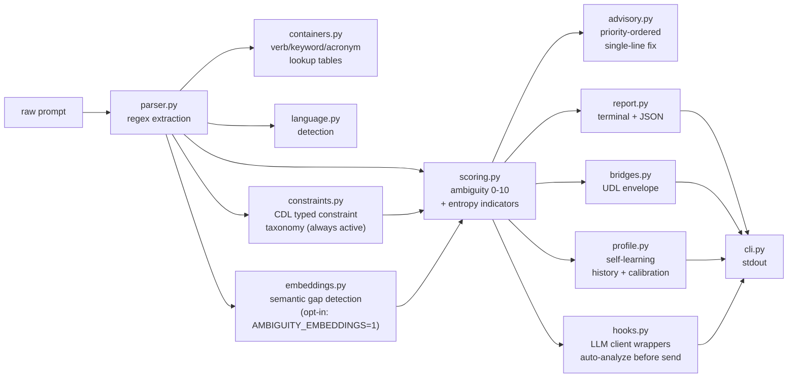

# ambiguity — Agent Guide

## Onboarding (read this first)

- **opencode.json** is the canonical agent entry point — opencode uses it
- **CLAUDE.md** is read by Claude Code on project entry
- **docs/QUICKSTART.md** has install, usage, and learning commands
- **docs/memory.md** tracks session history and open decisions
- **docs/AGENTS.md** (this file) — full conventions and handoff

This project has a **dual implementation**: Python (`src/ambiguity/`) for
Federation integration, TypeScript (`ts/src/`) as the canonical npm package.
**Keep both in sync** — same modules, same logic, same verb taxonomy.

## What this is

Deterministic prompt analysis for human-to-model translation. Pre-flight
linter that scores ambiguity, maps verbs to prediction-space containers,
expands acronyms, flags missing constraints, and outputs UDL envelopes.

Zero LLM calls. Zero token cost.

## Build / test

```bash
pip install -e .
pytest tests/
ambiguity analyze "your prompt here"
ambiguity analyze --pipe --json < prompt.txt
```

## Project structure

```
src/ambiguity/
├── __init__.py       # version
├── __main__.py       # python -m ambiguity
├── cli.py            # CLI entry point (analyze, learn, dismiss, config)
├── analyzer.py       # orchestration
├── parser.py         # verb, keyword, constraint, acronym extraction
├── containers.py     # verb taxonomy + keyword map + acronym registry
├── language.py       # language detection
├── scoring.py        # ambiguity score (0-10)
├── advisory.py       # single-line best practice advisory
├── profile.py        # self-learning profile (history, dismissals, calibration)
├── report.py         # terminal + JSON output
├── bridges.py        # UDL envelope wrapper (Federation)
├── hooks.py          # LLM client wrappers (auto-analyze before send)
├── rhetoric.py       # idiom, hedging, metaphor, framing detection
├── chunking.py       # clause splitting, phrasal verbs, contradictions
├── constraints.py    # CDL typed constraint taxonomy (7 types × 3 categories)
├── embeddings.py     # optional semantic gap detection (sentence-transformers)
├── flow.py           # Documentation flow-test (duplication, coverage auditing)
```

## Pipeline data flow



## Conventions

- **Deterministic only.** No module may call an LLM. All analysis is
  regex + dict lookup + arithmetic.
- **No external dependencies at runtime.** The UDL bridge is a try/import
  from C:\Federation — optional, silent failure.
- **Verb taxonomy lives in `containers.py`.** Add new verbs with specificity
  score and container mappings.
- **Keyword collisions go in `KEYWORD_MAP`.** If a word maps to multiple
  containers, add a `"collision"` key.
- **Acronyms go in `KNOWN_ACRONYMS`.** Expand to full form.
- **Vocabulary scope terms go in `VOCABULARY_SCOPE`.** Tag with domain (ecosystem/technical/metaphor).
- **Advisories go in `advisory.py`.** Priority-ordered, single-line,
  actionable.
- **Constraint taxonomy lives in `constraints.py`.** CDL types (7 types × 3 categories) with `upgrade_constraints()` and `ConstraintAnalysis.from_parse()`.
- **Embedding analysis is opt-in in `embeddings.py`.** Set `AMBIGUITY_EMBEDDINGS=1` to activate sentence-transformers gap detection; falls back gracefully when not set or not installed.

## Federation integration

- `bridges.py` imports `UnifiedDataLayerEnvelope` from `C:\Federation` when
  available
- Output can be written as UDL envelopes to `data/reports/ambiguity/`
- CHAP surface packet can register this as a Federation surface

## Hook modes (available now)

The engine can be preloaded as a middleware layer that auto-analyzes prompts:

| Mode | How | What it does |
|------|-----|-------------|
| `AnthropicHook` | `from ambiguity.hooks import AnthropicHook` | Wraps Anthropic client, scores every prompt before send |
| `OpenaiHook` | `from ambiguity.hooks import OpenaiHook` | Wraps OpenAI client, same behavior |
| `--watch <dir>` | `ambiguity analyze --watch docs/` | Monitors directory, analyzes new/changed `.md` files live |
| Git pre-commit | installed at `.githooks/pre-commit` | Blocks commit if `.md` files score > 6.0 |
| Pipe mode | `echo "prompt" \| ambiguity analyze --pipe` | Any-pipeline integration |

All hook modes log to `~/.ambiguity/hooks.log` and respect profile-based threshold calibration.

### Hook configuration

```python
from ambiguity.hooks import AnthropicHook, HookConfig

hook = AnthropicHook(
    api_key="sk-...",
    config=HookConfig(gate=6.0, on_exceed="block")
)
# "warn" | "block" | "log"
```

## Gate enforcement

Three layers of gate enforcement, all using `--gate <threshold>`:

| Layer | How | What it does |
|-------|-----|-------------|
| Pre-commit hook | `.githooks/pre-commit` | Blocks commit if staged `.md` files score > gate (default 6.0) |
| `--gate` flag | `ambiguity analyze "prompt" --gate 6.0` | Exit code 1 if score exceeds threshold |
| CI workflow | `.github/workflows/ambiguity-gate.yml` | Blocks PR merge if changed files score > 6.0 |

Configure gate threshold with `AMBIGUITY_GATE` env var or `--gate <value>`.

CI workflow triggers on PRs and pushes that modify `.md` or `.txt` files.

## Compare command

```bash
# Full experiment (requires ANTHROPIC_API_KEY or OPENAI_API_KEY)
ambiguity compare "write a poem about a cat"

# Prompt-only mode (generates files for manual testing)
ambiguity compare "write a poem about a cat" --no-llm --output-dir ./experiment

# JSON output
ambiguity compare "write a poem about a cat" --no-llm --json
```

The `compare` command:
1. Runs ambiguity analysis on the prompt
2. Builds an enriched version with findings prepended
3. (If API keys available) submits both to an LLM
4. Compares control vs treatment on word count, vocabulary overlap
5. Outputs experiment files with `--output-dir`

## Roadmap (not yet implemented)

- `ambiguity review <response>` — post-flight response analysis
- `ambiguity chunk <prompt>` — multi-instruction splitting
- `ambiguity spell <text>` — surface-level corrections

## Project surfaces

ambiguity targets all major AI agent platforms via surface files:

| Platform | Surface file |
|----------|-------------|
| opencode | `opencode.json` |
| Claude Code (Anthropic) | `CLAUDE.md` |
| Cursor | `.cursor/rules/` (scoped `.mdc` rules) |
| GitHub Copilot | `.github/copilot-instructions.md` |
| GitHub Copilot (scoped) | `.github/instructions/python.instructions.md` + `.github/instructions/typescript.instructions.md` |
| Windsurf (Codeium) | `.windsurf/rules/` |
| Aider | `CONVENTIONS.md` |
| Cline / Roo | `.clinerules/` (directory rules) |
| Gemini CLI (Google) | `.gemini/GEMINI.md` |
| Grok CLI (xAI) | `.grok/GROK.md` |

Keep all surface files in sync when project conventions change.

## Handoff

If working on this project:
1. Run `pytest tests/` before and after changes
2. Add tests for new parser patterns or advisory rules
3. Verify the CLI works: `ambiguity analyze "test" --json`
4. If modifying the UDL bridge, test with and without C:\Federation available
5. Keep all surface files in sync when conventions change
