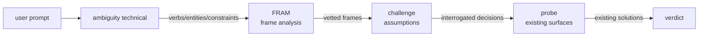

# Technical Direction Pipeline

Chains `ambiguity → FRAM → challenge → probe` to assess technical direction from a
user prompt. Handles questions like "is this the right architecture?", "are they
rebuilding something existing?", "is this over-engineered?".

## Pipeline Stages



### Stage 1: ambiguity technical

Deterministic only. No LLM calls. Takes a prompt and produces:

- **Ambiguity score + band** — how well-specified is the request?
- **Technical entities** — databases, languages, frameworks, architectural concepts extracted from the prompt
- **Overengineering signals** — "enterprise", "scalable", "distributed", "fault-tolerant", etc.
- **Reinvention signals** — patterns matching existing open-source solutions (message queues, auth, caching, etc.)
- **Red flags** — contradictions, missing constraints, vague tech context
- **Handoff package** — structured input for each downstream skill

### Stage 2: FRAM (Framework Analysis Method)

Takes the technical entities and red flags from Stage 1. Runs one of:

| Mode | When | What |
|------|------|------|
| `analyse` | Specific entities found (e.g. "redis as vector DB") | 8-perspective fitness analysis of the proposed component |
| `triple-layer` | No specific entities, general tech direction | Canonical/targeted/meta questions about the approach |
| `stress-test` | Overengineering signals detected | "What would have to be true for this to fail?" |

### Stage 3: challenge (design mode)

Takes FRAM's findings + any red flags. Interrogates architectural decisions:

- "Why this and not an existing solution?" (reinvention risk)
- "Do stated assumptions have supporting evidence?" (scope creep)
- "What would break this architecture?" (stress-test)
- "What foundational assumption could be wrong?" (inversion)

### Stage 4: probe (existing surfaces)

Takes the interrogated findings and checks what already exists in the codebase:

- Cross-pollinates design philosophy from existing adopted surfaces
- Extracts architecture patterns and maps them (align/adapter/fork/absorb/defer)
- Produces alignment recommendations for each gap found

## Usage

```bash
# Terminal report
ambiguity technical "build a distributed event-driven microservice platform"

# JSON handoff package (for automation / downstream consumption)
ambiguity technical "build a distributed event-driven microservice platform" --json

# Pipe from stdin
echo "add a real-time notification system" | ambiguity technical --pipe
```

## Exit Codes

| Code | Meaning |
|------|---------|
| 0 | No red flags — direction appears sound |
| 1 | Red flags detected — review before proceeding |

## Data Contract

The JSON output (`render_technical_json()`) produces:

```json
{
  "pipeline": "ambiguity → fram → challenge → probe",
  "version": "0.1.0",
  "prompt": "...",
  "ambiguity": {
    "score": 6.8,
    "band": "high",
    "verbs": ["build"],
    "constraints": [],
    "entropy_indicators": ["no explicit constraints"],
    "container_overlap": 3,
    "verb_specificity": 0.6
  },
  "technical_entities": [
    {"name": "kafka", "domain": "infrastructure", "entity_type": "message_queue"},
    {"name": "kubernetes", "domain": "infrastructure", "entity_type": "orchestration"}
  ],
  "red_flags": [
    "overengineering signals (distributed, enterprise) with vague verbs",
    "technical entities specified but no constraints"
  ],
  "maturity_signal": "warning — vague or over-scoped",
  "overengineering_signals": ["distributed", "enterprise"],
  "reinvention_signals": [],
  "handoff": {
    "fram": {
      "target": "kafka, kubernetes",
      "mode": "analyse",
      "reason": "Evaluate technical fitness of: kafka, kubernetes"
    },
    "challenge": {
      "targets": ["design: validate overengineering signals",
                   "design: interrogate architectural decisions"],
      "reason": "Illuminate assumptions behind: distributed, enterprise"
    },
    "probe": {
      "target": "kafka",
      "reason": "Probe existing surfaces in codebase related to: infrastructure"
    }
  }
}
```

## Federation Surface Registration

This pipeline is registered as a Federation surface. The CHAP entry:
- **Surface**: `technical_direction_pipeline`
- **Version**: `0.1.0`
- **Entry point**: `ambiguity technical --json`
- **Downstream skills**: `fram`, `challenge`, `probe`, `scout`
- **Contract layer**: Deterministic pre-flight (ambiguity) → LLM-assisted judgment (FRAM/challenge/probe)

## Known Gaps

- `ambiguity technical` uses regex keyword matching for technical entity extraction —
  no semantic understanding. A prompt saying "let's persist user sessions" won't
  match `redis` unless the word "redis" appears.
- Reinvention patterns are currently a small curated list — contributions welcome
  in `technical.py:REINVENTION_PATTERNS`.
- The pipeline assumes Federation skills are available at C:\Federation.
  Standalone use produces the handoff package but cannot execute downstream stages.
